# 使用 obs 网页端创建项目

本文档旨在记录如何在 OBS 的网页端上创建一个项目并开始 Risc-V 软件包构建。

## 0. 准备

首先，你需要在[网页端](https://build.tarsier-infra.isrc.ac.cn/)上创建一个账户。

## 1. 创建并配置项目

请点击图中的 Home Project，你会进入到一个以你用户名命名的默认项目中：

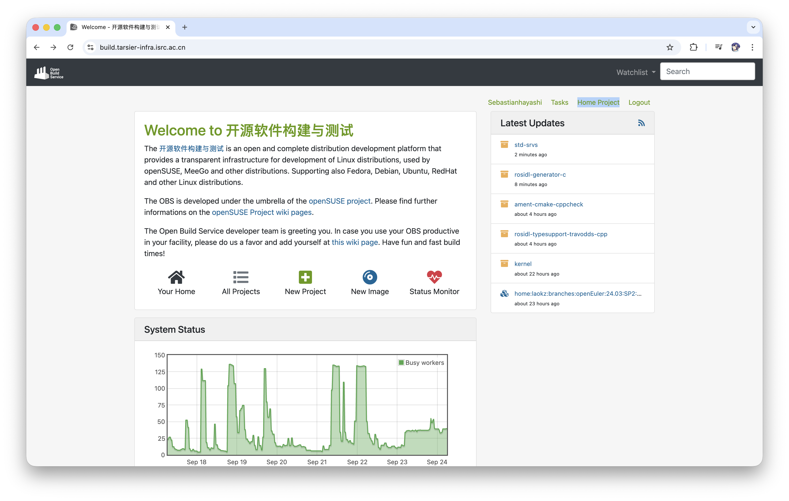

你可以在当前的默认的项目中开始你的软件包构建的，如果你有不同项目的软件包需要构建你也可以选择开一个副项目（subproject），先让我们从默认项目开始进行说明。

这里我们以为 openEuler 24.03 LTS RISC-V 构建软件包为例。你需要进入项目的 repositorie 下去为项目配置软件源仓库，如下图：

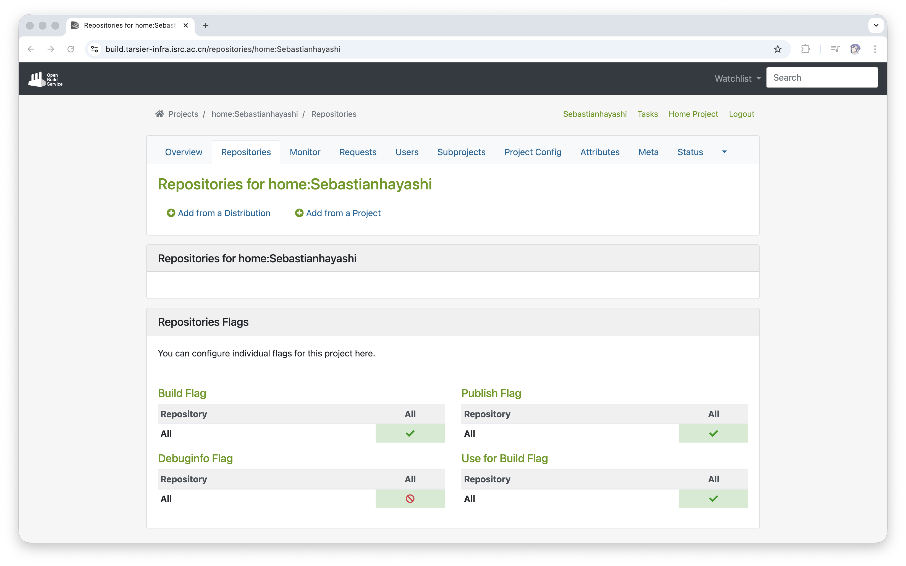

接着请点击图中的： Add from a Project：

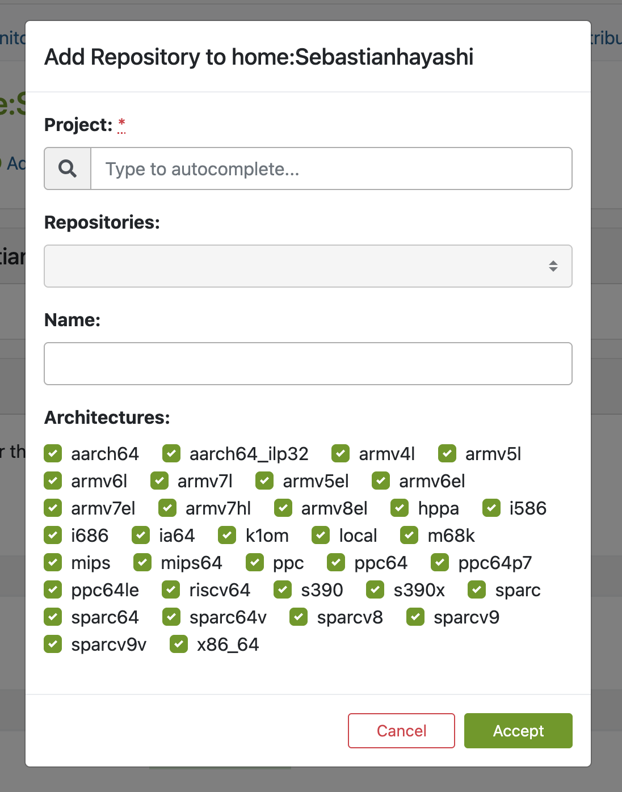

这里需要根据你所需要构建的软件包来选择不同的内容，以下是示例：

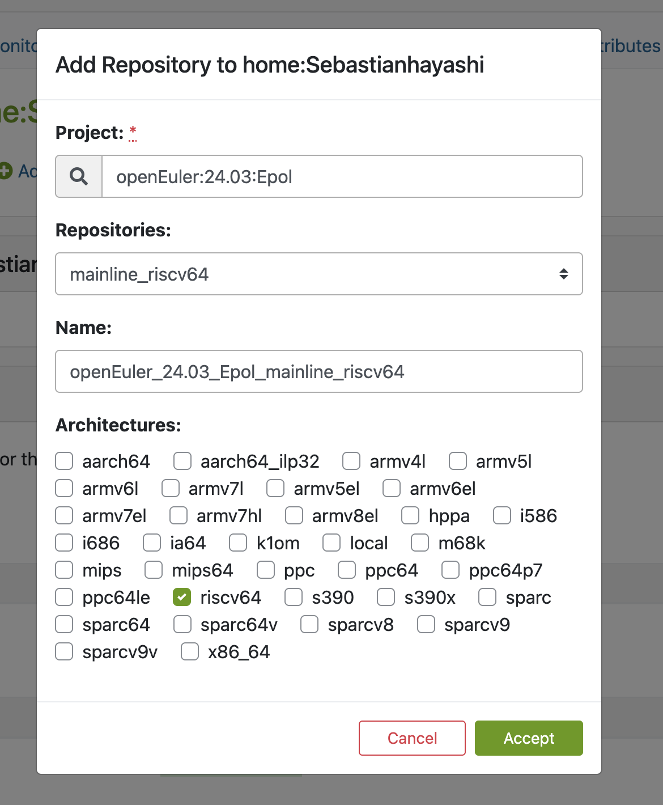

按照同样的方式继续添加 openEuler:24.03/mainline_riscv64：

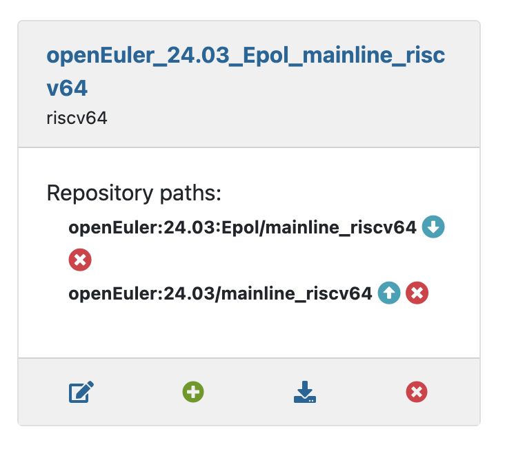

> 这里仅作示例，请按照实际情况进行调整！

如果你需要创建多个项目，请点击 subproject 进入副项目页面：

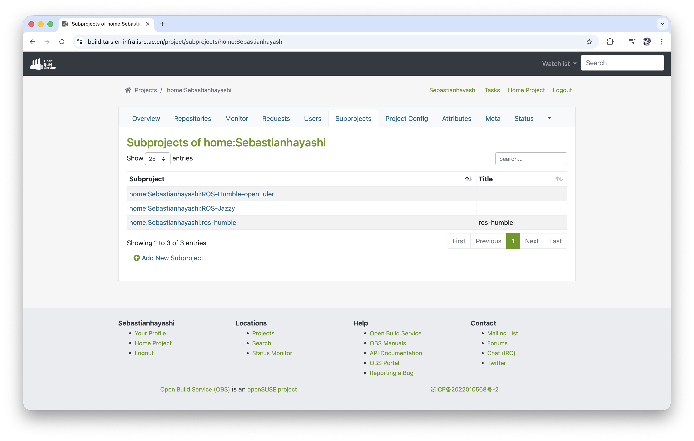

请继续点击 Add New Subproject：

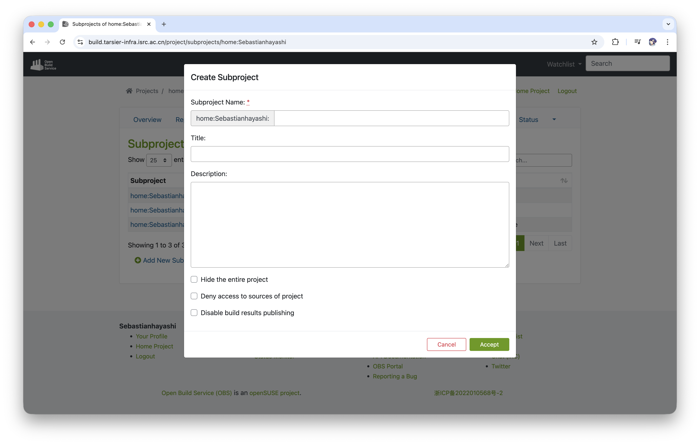

创建完了项目之后可以按照上述内容同样的步骤为你不同的项目去配置仓库。

## 2. 创建软件包

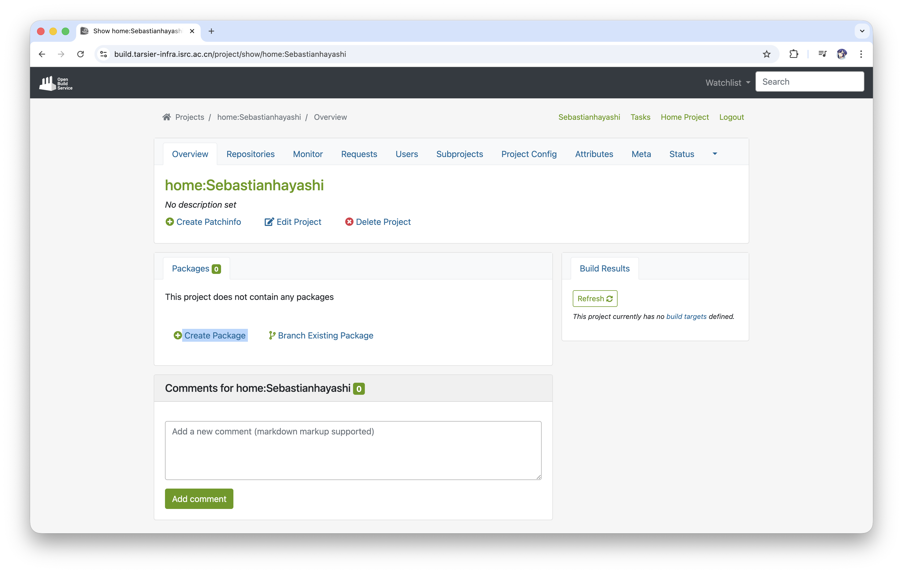

你可以点击 Create Package 按钮以创建你的软件包，你会得到如下图的弹窗，按照上面的要求依次填入包名（Name），其余选项（Title、Description）都为可选选项，这里包名以 test 为例。

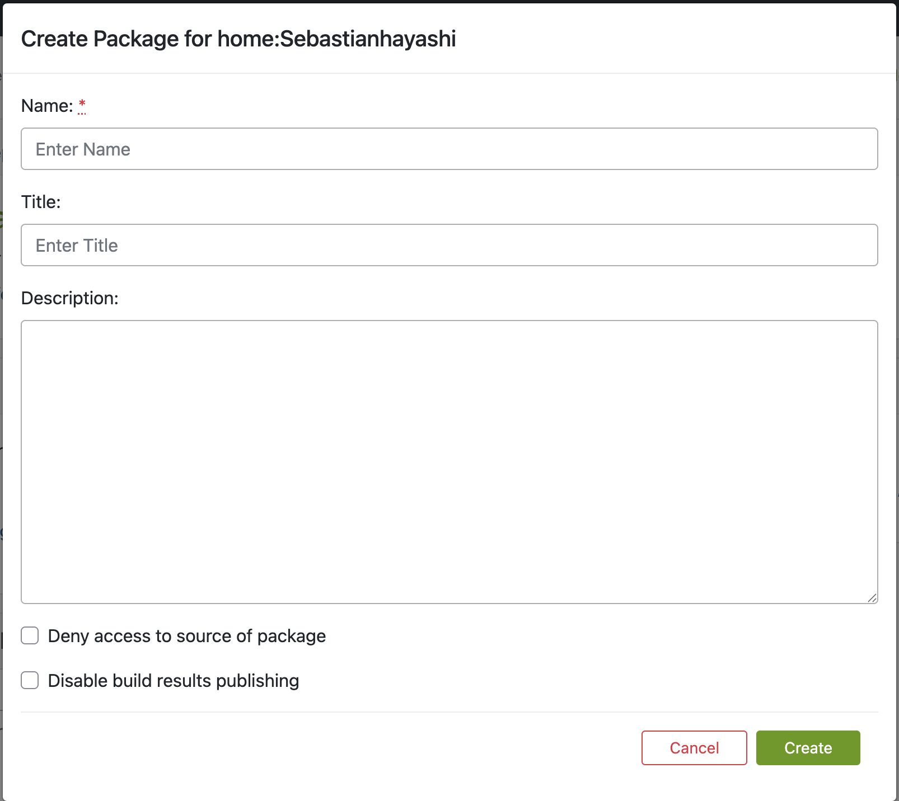

当你输入完包名后你就成功的在当前项目下创建了一个软件包，但是此时软件包还是空的，你还需要放入你的源码等内容，此时你可以点击如下图中的 add file：

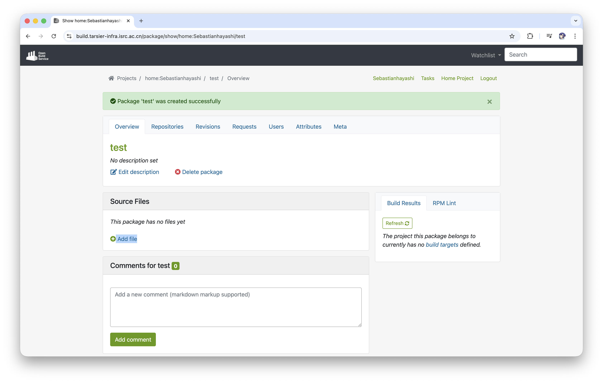

你单独的添加每一个文件，如 src.tar.gz/.spec 等。你也可以选择从你的本地上传你的源码以及 .spec 文件。

目前仅支持本地上传文件，似乎不支持使用 URL 添加 srpm。

如果你是学习如何构建软件包，你可以暂时使用上述内容添加少量的软件包学习，如果你目前有大量的软件包需要构建，不推荐使用网页端去添加软件包，目前网页端没有什么批量添加软件包的功能，可以参考另一篇文章如何[使用 obs 命令](https://github.com/Sebastianhayashi/ROS-Porting/blob/main/Building_platform/OBS_Cli.md)。

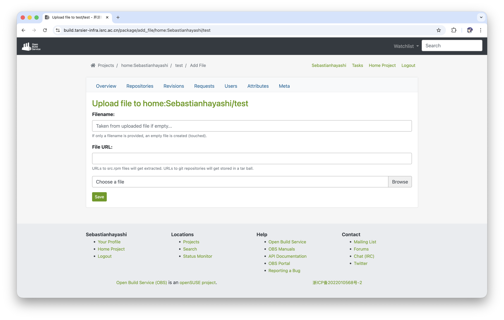

## 3. 构建

当你创建并配置完你的限度，并且将源码压缩包以及 .spec 上传至你的项目内时，OBS 会开始自动为你构建你的软件包，你无需点击开始构建等操作。

当你的软件包都构建完成了之后，在右侧的 Build Result 中你可以看到你的软件包构建结果。

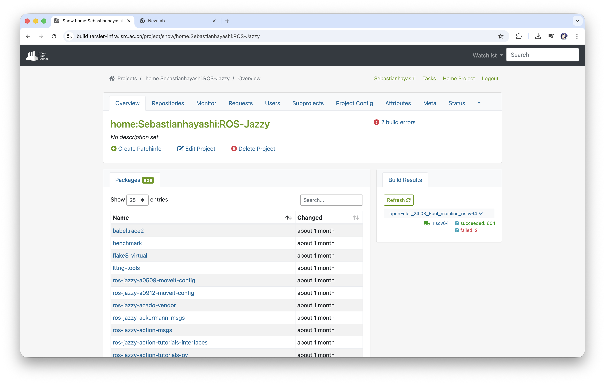

你也可以点击下图中你的仓库的名字去获取你构建成功的软件源：

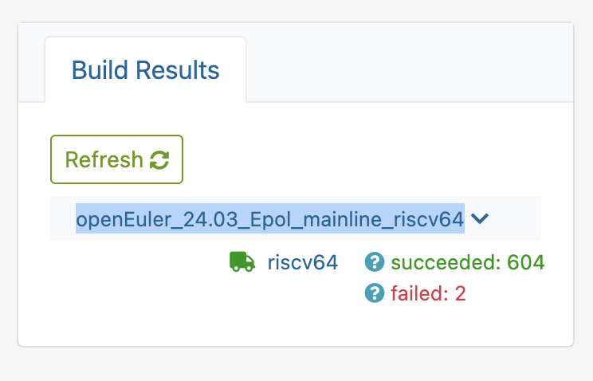

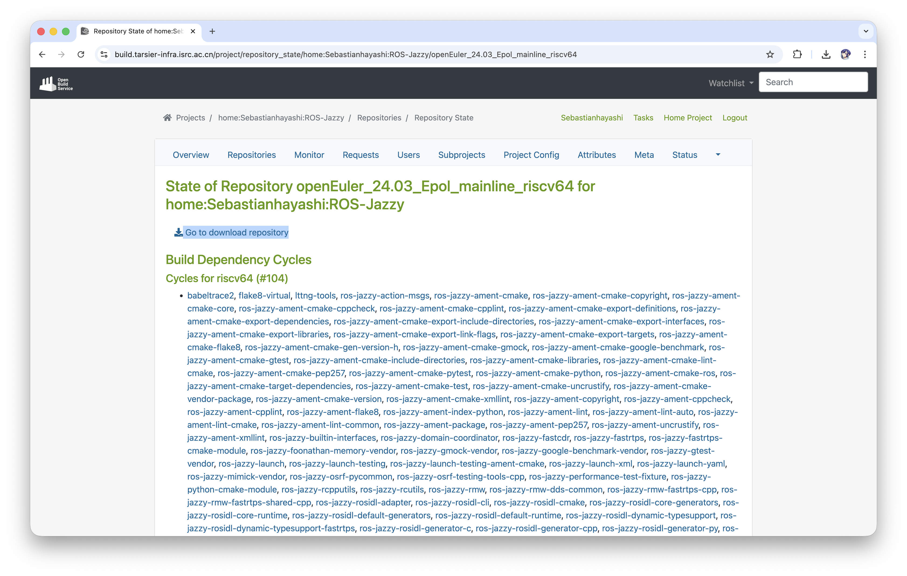