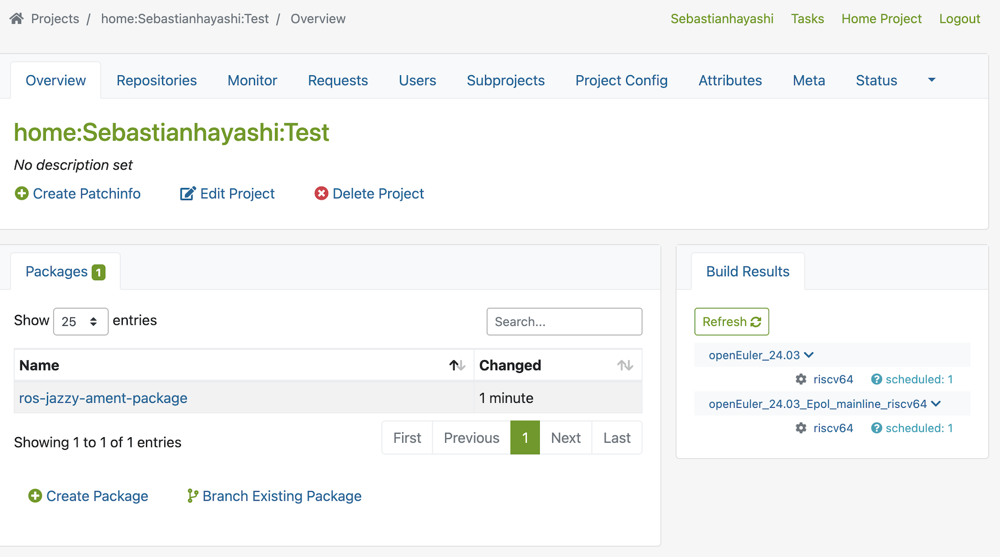
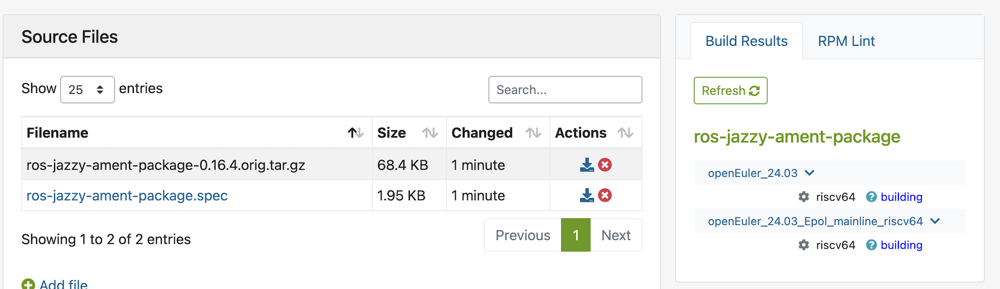

# 更进一步的使用 OBS

**请优先阅读如下内容**

本文适合已经阅读过 openEuler 官方文档的情况：

1. [如何使用 openEuler OBS - （一）介绍](https://www.openeuler.org/zh/blog/fuchangjie/2020-03-26-how-to-OBS.html)
2. [如何使用 openEuler OBS - （二）与gitee的联动](https://www.openeuler.org/zh/blog/fuchangjie/2020-03-26-OBS-with-Git.html?utm_source=chatgpt.com)


本文不对上面内容重复阐述，本文适合需要在 tarsier-OBS 上构建 openEuler RISC-V 软件包的情况。如果要构建其他架构的软件包的情况，不建议使用 OBS。可以参考 eulermaker 或者 EUR。

OBS 的使用逻辑与 eulermaker 存在明显的差异，许多同事抱怨过 OBS 不好用的情况，所以本文针对同事们存在的问题去解释 OBS 的使用逻辑，如何正确地使用 OBS 进行软件包构建、调试等。 

一般情况而言，在 eulermaker 等构建平台完成了如 x86 等架构的软件包构建任务后，会有同时有 srpm 作为附属产物。这时候可以直接使用 srpm 作为输入物进行构建，这么做可以快速验证软件包的构建正确性，不需要去配置 gitee 相关的内容。

需要做的事是把 `.srpm` 下载到本地，再使用 OBS 的 cli 配合脚本进行批量上传即可快速验证软件包的构建正确性。但是这么做不一定符合规范，请按照实际情况选择适合自己的构建方式。

本文会优先讲述使用 srpm 作为构建源输入物的情况，再说明如何使用 OBS 配合 gitee 去进行构建。

同时对于一些构建工作中出现的问题，如如何配置工程、如何使用脚本完成批量 srpm 导入等一些经验分享。


## 使用 `.srpm`

在使用 `.srpm` 作为源输入物时需要在本地根据 openEuler 官方的教程配置好本地环境，确保系统可以正确的在本地使用 OBS。如果你使用的是 tarsier-OBS，请参考[这里](https://github.com/Sebastianhayashi/ROS-Porting/blob/main/Building_platform/Create%20_project_on_OBS.md)以便配置本地环境。

准备好了环境以及本地已经下载好了 srpm 后，使用 `osc importsrcpkg`，这条指令会将你本地的 srpm 还原成 OBS 需要的源目录结构（spec、源码、patch 等），然后再进行提交。这样 OBS 就会自动在 riscv64 对应的仓库开始构建。

那么让我们用 ament_package 作为例子来演示如何从 0 开始上传 srpm 到 OBS。首先你需要准备好 srpm，放在本地任意文件夹中即可。接着准备好本地 `osc` 相关环境配置即可。

```
## 安装 osc

sudo dnf install -y osc build
```

接着你需要在 web 端上创建好对应的项目，这里默认你已经有了一个项目，这里以 Test 作为案例：

```
## 列出所有相关项目
osc -A https://build.tarsier-infra.isrc.ac.cn ls
```

> 这里的 -A 指的是指定 API 地址，这里如果你没有配置过 osc 也没关系，osc 监测到没有配置过的话会让你输入账号密码进行配置，配置成功后会列出当前所有的项目。

你的终端中能输出类似如下的项目就说明配置成功了：

```
openEuler:selfbuild:repo
openeuler.org
openeuler:OpenStack
openeuler:OpenStack:Antelop
openeuler:OpenStack:Wallaby
remote:openEuler:Mainline
```

接着将你的项目保存到本地，这里使用的是 `osc co` 指令。意思是 osc checkout，接着你在本地会得到一个以你项目命名的文件夹：

```
osc co <your_project>

## 这里以我的项目为例

osc home:Sebastianhayashi:Test
```

当你可以在当前文件中看到你 checkout 下来的项目文件夹的时候就可以了，接下来需要做的就是将 srpm 上传到这个文件夹中并且进行提交：

```
## checkout 下来的项目

[xiaoyun@xiaoyun-openeuler-01 ~]$ ls
home:Sebastianhayashi:Test  srpms

## 上传并提交`.srpm`

osc importsrcpkg -c ../srpms/ros-jazzy-ament-package-0.16.4-0.oe2403.src.rpm
```

> `osc importsrcpkg -c` 该命令会直接将你指定路径中的 `.srpm` 上传并且提交到 obs 中，到此就算是结束了。

在 Web 端中，我们可以看到刚刚上传的 `.srpm` 已经成功上传至 OBS 中了，同时右下角也显示构建状态为 Scheduled。



以防万一，我们可以点击软件包查看详情，检查 `.srpm` 是否有被正确的解压成 OBS 需要的结构。



`.srpm` 已经被成功的解压成 `.spec` 以及源码压缩包了，同时右边的构建状态为：Building。

如果此时你需要批量上传 `.srpm` 的话，`osc` 指令一次上传一个 `.srpm`。这时候需要自己写脚本来实现批量上传。这里提供流水线思路，同时提供一个示例脚本。

大体思路：

> `osc importsrcpkg` 批量解压 `.srpm` > `osc addremove` 自动检测改动 > 上传 `obs ci` TODO

一般而言，脚本需要根据 SRPM 推导出包名，然后创建对应文件夹，再 checkout 到对应的包目录里...

## 不使用 `.srpm`（即 spec +源码）

如果你是刚在学习如何使用 OBS、需要给单独某个软件包进行升级又或者是无法使用 `.srpm` 等的情况时，有两种方式可以将源码上传至 OBS 上：

1. 使用 `_service` 绑定 Gitee 仓库
2. 网页端上传

openEuelr 官方文档《[如何使用 openEuler OBS - （二）与gitee的联动](https://www.openeuler.org/zh/blog/fuchangjie/2020-03-26-OBS-with-Git.html?utm_source=chatgpt.com)》中已经十分详细的讲述了如何使用 `_service` 绑定 Gitee 仓库。

这里不做过多阐述，使用一个案例来简单演示如何使用 OBS 配合 Gitee 进行构建。

TODO

## OBS 工作逻辑及其调试

> 前文讲述了如何将源输入物上传至 OBS，接着我们讲讲 OBS 开始构建后会出现的情况。

在 eulermaker 等构建平台上会有开始构建等的按钮，在 OBS 上是没有的，只有 `Trigger rebuild`、`rebuild`，这样的按钮。

（补图，TODO）

OBS 的工作逻辑是，当你上传的软件包那么就自动开始进行检查工作，比如说依赖是否满足、上传的文件是否有问题等。如果没有问题则直接进入构建环节，不需要单独的点击构建。

如果 OBS 检查到你上传的文件无法构建， 一般分为如下几个情况：

1. `exluded`：这个情况通常是 spec 中把 RISC-V 排除掉了，比如说 `Exclusice/Arch` 里面没写 riscv64，或者 `ExcludeArch` 明确写了 riscv64。这时候需要检查一下这个包是否支持 riscv64。

2. `unresolvable`：这是缺少依赖的情况，OBS 会直接告诉你缺少什么依赖所以无法构建。

3. `failed`：字面意思就是失败了，这时候是你需要去看日志排查问题出在哪。

在实际构建的时候，工程配置 TODO

## 附录：常见命令